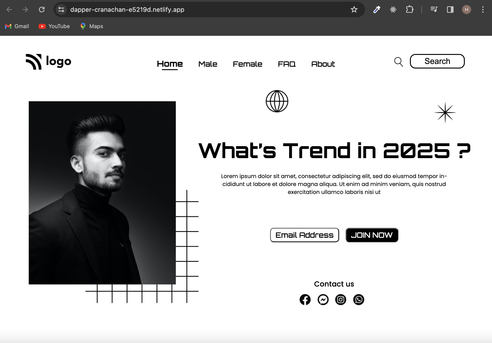

[Street Style Landing Page](https://dapper-cranachan-e5219d.netlify.app/)

 
 
### Project Name : Street Style Landing Page !

### Creating a Responsive Web Design with Pure HTML and CSS: A Focus on Desktop Positions

# ✨ Tech Stack Used :

 

 

In the dynamic landscape of web development, creating a visually appealing and user-friendly interface is crucial. One approach to achieve this is by using pure HTML and CSS to build a responsive web design that seamlessly adapts to various screen sizes. This short article will outline the key aspects of a project developed with HTML and CSS, with a primary emphasis on positioning elements for desktop screens

### Project Overview

The project at hand is developed using only HTML and CSS, showcasing the power of these foundational web technologies. While frameworks and libraries are popular for efficiency, a purist approach allows for a deep understanding of the fundamentals.

### Demo :

### You can Check it Live on Below Link :

[Live Link !](https://dapper-cranachan-e5219d.netlify.app/)

### HTML Structure

The HTML structure sets the foundation for the web page. It includes the necessary elements and semantic tags to define the content's structure. Here's a simplified example:

### CSS Styling

CSS is utilized to style the HTML elements and position them appropriately. In this example, we focus on desktop positioning, ensuring a polished appearance on larger screens.

### Desktop Positioning

For desktop screens, we use a simple flexbox approach to center the content vertically and horizontally within the body. The header and footer span the entire width, while the main content is constrained to a maximum width for better readability.

### Conclusion

Developing a project with pure HTML and CSS for desktop positions demonstrates a commitment to understanding the core technologies that power the web. By focusing on responsive design principles, your project will not only look polished on desktops but will also serve as a solid foundation for future enhancements and adaptations to different devices. As the project evolves, consider exploring additional CSS features and media queries to extend its responsiveness across various screen sizes.